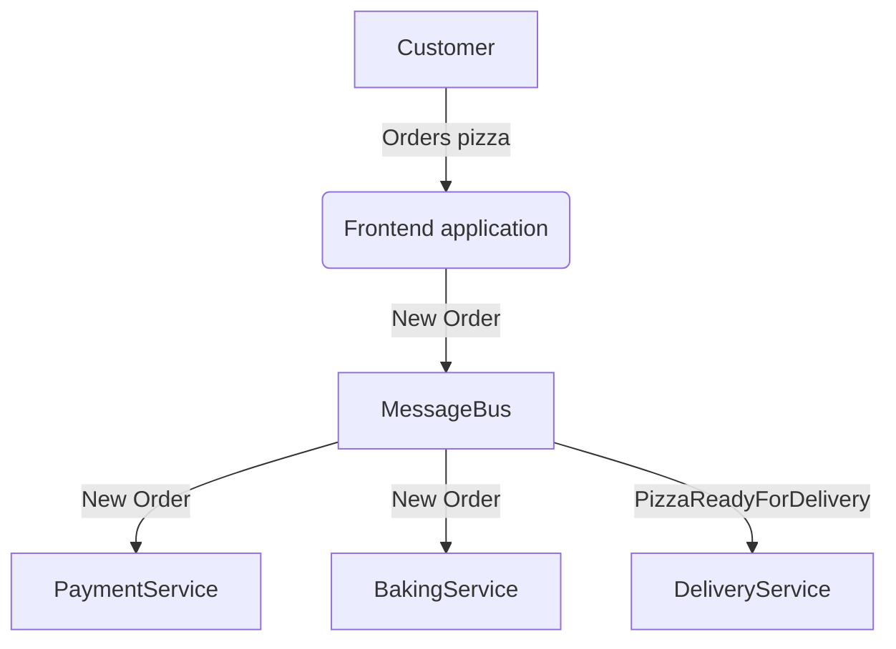
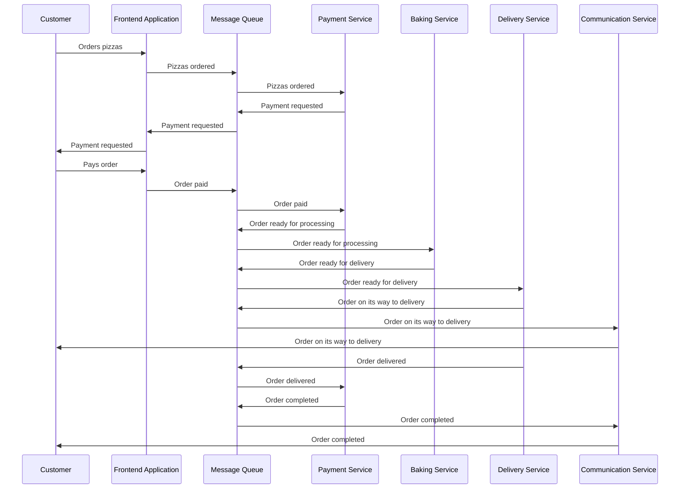

# Distributed Pizza Hut

This Distributed Pizza Hut is my attempt to practice with some distributed principles. A frontend where one can order pizza's, some queuing and processing of orders and deliveries. I might add some chaos too.

## Try it out

1. Start RabbitMQ and ZipKin: `docker-compose -f docker-compose.tools.yml up`.
2. Start the three dotnet projects: `PaymentMicroservice`, `OrderMicroservice` and `FrontendApplication`.
3. When everything is running, press enter in the console of the Frontend application.
4. See what happens :)

## Context Diagram

### Different states / events

* PizzasOrdered
* OrderPaid
* OrderPrepared
* OrderReturned
* OrderDelivered
* OrderDelayed
* OrderCompleted

## Order process

